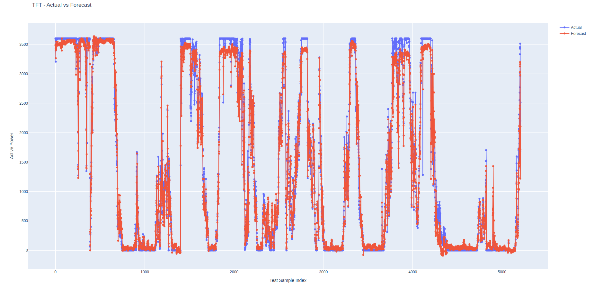
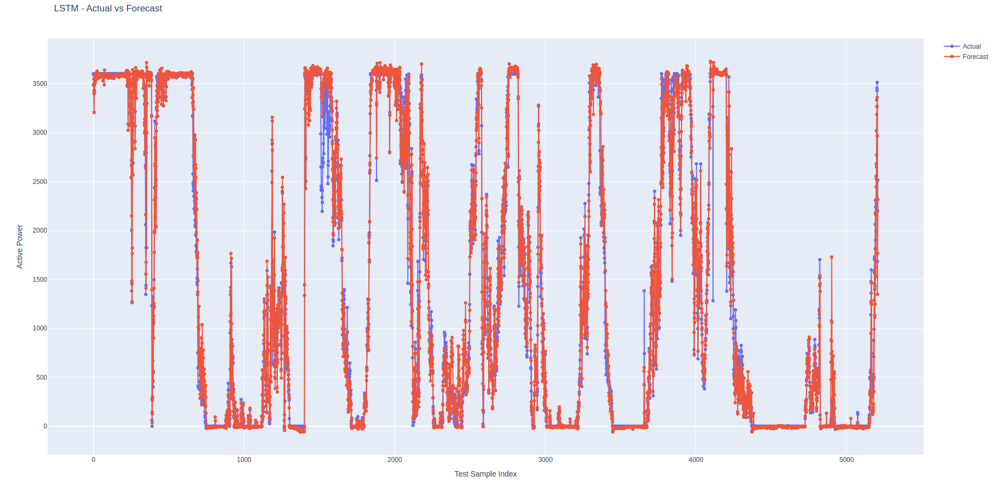
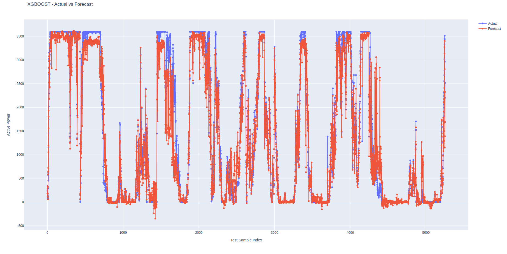

# Wind Power Forecasting with TFT, LSTM, and XGBoost

## Project Overview

This project implements a comparative wind energy forecasting solution using three distinct machine learning approaches to predict wind turbine active power generation:

- **Temporal Fusion Transformer (TFT)** – Transformer-based deep learning model for complex time-series relationships.
- **Long Short-Term Memory (LSTM)** – Recurrent neural network effective for sequence modeling.
- **XGBoost** – Gradient boosting tree-based model ideal for structured data and regression tasks.

The project incorporates advanced feature engineering, external meteorological data integration, and robust data preprocessing to enhance predictive accuracy and reliability.

---

## Data Sources

- **Historical Turbine SCADA data**: [Wind Turbine Dataset (Kaggle)](https://www.kaggle.com/datasets/berkerisen/wind-turbine-scada-dataset)
- **Meteorological data**: Integrated via Meteostat [(location assumption based on the discussions)](https://www.kaggle.com/datasets/berkerisen/wind-turbine-scada-dataset/discussion/86526)
- **Astronomical calculations**: Day/night differentiation using Astral

## Data Preparation and Feature Engineering

- **Dataset**: Historical wind turbine data recorded at 10-minute intervals.
- **Datetime Handling**: Data is sorted, indexed, and resampled to maintain completeness.
- **Feature Engineering**:
  - Determined turbine cut-in speed (minimum wind speed needed for power generation).
  - Generated temporal features: hour, month, and season.
  - Day/night classification using geographical coordinates via Astral.
  - Integrated temperature data from Meteostat API, aligned to match the data frequency.
- **Missing Data Handling**: Missing values are forward-filled, and their locations indicated via an imputation mask.
- **Derived Features**:
  - Computed delta values (changes in temperature, wind speed, wind power) to enhance trend detection.
- **Feature Scaling**: Applied standard scaling (StandardScaler) to normalize feature distributions for improved model convergence.
- **Target Scaling**: The target variable (active power) is min-max scaled by dividing by 3600, representing the theoretical maximum output, ensuring values range between 0 and 1 for optimal model training.

## Modeling Approaches

### 1. Temporal Fusion Transformer (TFT)

- Transformer architecture optimized for time-series forecasting.
- Captures complex, non-linear relationships through attention mechanisms.
- Implements gradient clipping and dropout regularization to improve training stability and generalization.

### 2. Long Short-Term Memory (LSTM)

- Recurrent neural network tailored for sequential data modeling.
- Suitable for capturing temporal dependencies.
- Simpler architecture compared to TFT, beneficial for benchmarking and faster training.

### 3. XGBoost Regressor

- Tree-based gradient boosting algorithm.
- Non-neural, highly effective for structured data.
- Efficiently handles feature interactions, robust to missing values, and suitable for baseline comparison.

## Data Preparation for the Model

- **Sliding Window**: Sequences of historical data (`SEQ_LENGTH = 45`) used to forecast one step ahead (`FORECAST_HORIZON = 1`).
- **Train/Validation/Test Split**: Chronologically split into 80% training, 10% validation, 10% testing to ensure realistic forecasting evaluation.

## Model Training and Evaluation

- **Training**:
  - Neural networks (TFT, LSTM) trained with Adam optimizer, MSE loss, and early stopping based on validation performance.
- **Evaluation Metrics**:
  - **R² Score**
  - **Root Mean Squared Error (RMSE)**

Comparison results:

| Model   | R² Score   | RMSE        |
|---------|------------|-------------|
| TFT     |   0.988    |   161.865   |
| LSTM    | **0.990**  | **151.023** |
| XGBoost |   0.934    |   385.391   |

## Visualization

- Interactive visualization using Plotly compares actual vs. predicted active power (below screenshots are provided)

## Why This Matters

Accurate wind power forecasting enhances renewable energy management, reducing uncertainty in operations and improving efficiency. Comparing multiple modeling approaches allows selecting the most appropriate method based on performance and complexity.

## Potential Applications

- Wind farm operational optimization
- Energy production scheduling and forecasting
- Decision-making support in energy markets
